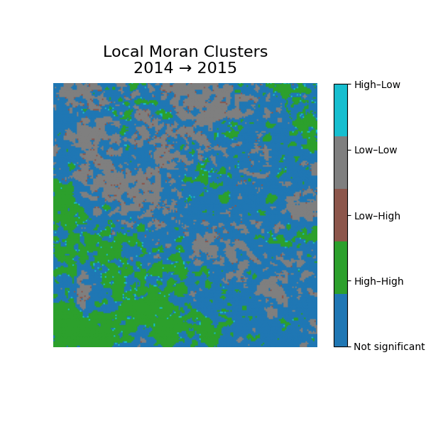
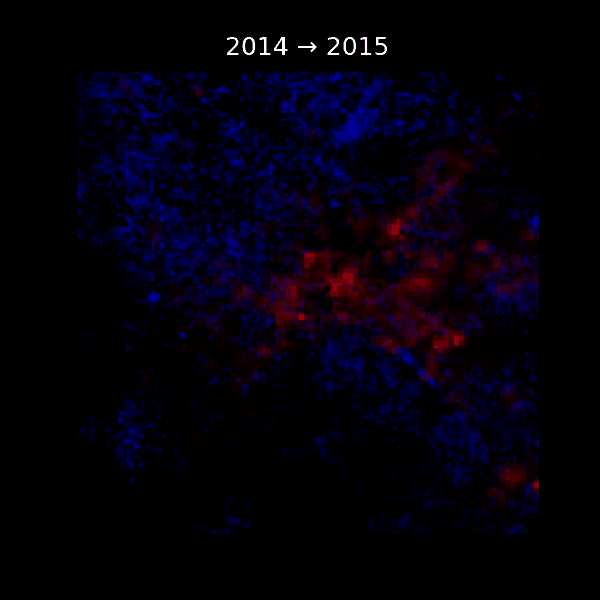

# Urban Growth and Vegetation Loss from Space

This repository demonstrates a quick geospatial analysis using satellite-derived NDVI and Nighttime Lights data to assess urban expansion and vegetation loss for a selected region.

## Project Goal

To visualize and analyze the changes in vegetation (NDVI) and economic activity (VIIRS Nighttime Lights) over a decade, using geospatial raster data.

## Directory Structure

```
.
├── data/
│   └── processed/         # Contains sample GeoTIFFs (NDVI and VIIRS)
├── notebooks/
│   └── analysis.ipynb     # Main notebook for exploration and visualization
├── src/
│   ├── download_data.py   # Placeholder for data acquisition logic
│   ├── preprocess.py      # Load and compute raster differences
│   └── visualize.py       # Mapping functions for NDVI and nightlights
├── outputs/               # Optional output folder for maps and graphs
├── requirements.txt       # Python dependencies
└── README.md              # Project overview
```

## How to Run

1. Install dependencies:

```bash
pip install -r requirements.txt
```

2. Launch the notebook:

```bash
jupyter notebook notebooks/analysis.ipynb
```

## Sample Outputs

- NDVI change maps between 2014 and 2023
- VIIRS Nighttime Lights change maps
- Visual correlation between urban growth and vegetation loss

## License

MIT License


